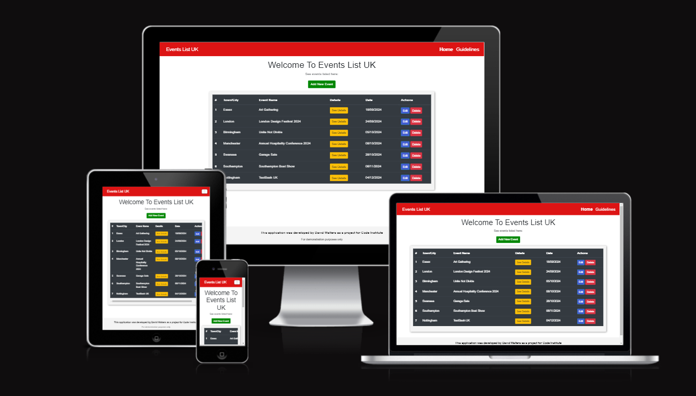
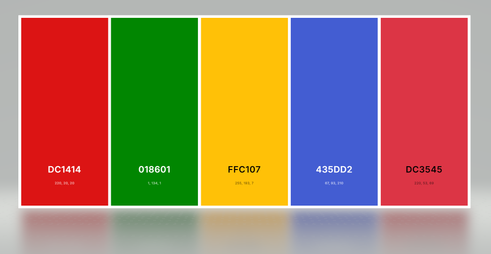
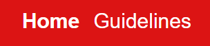
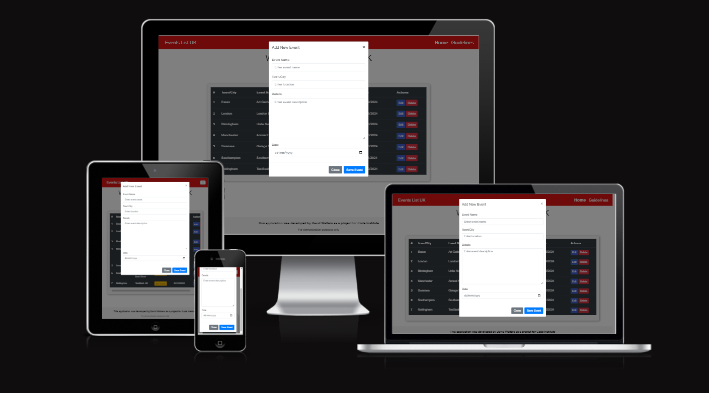
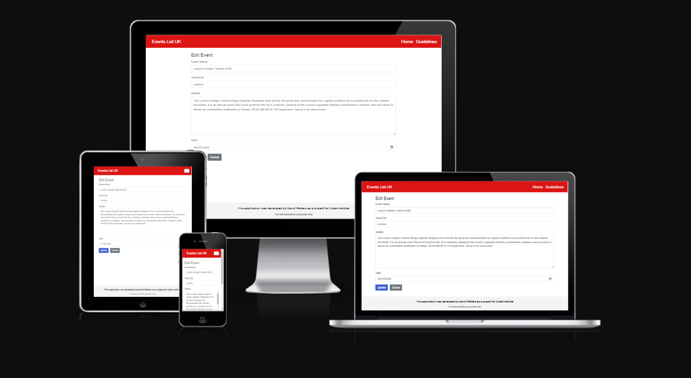
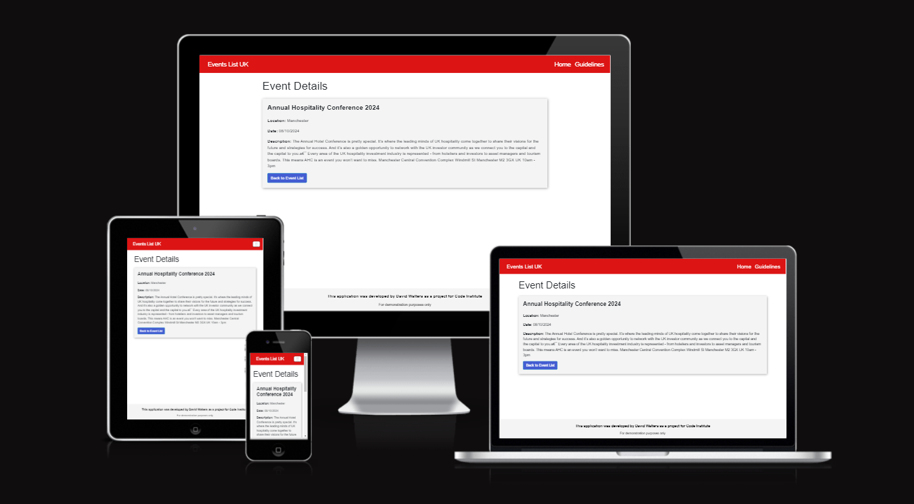
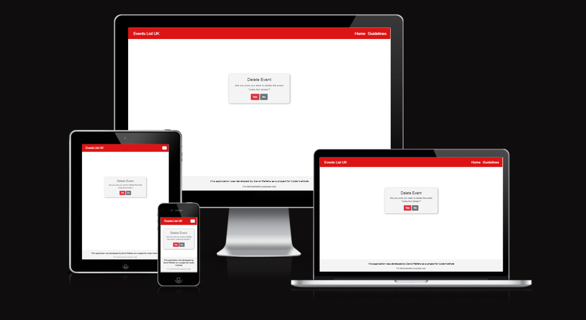
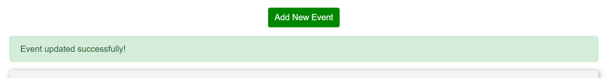

# My Flask Project: Events List UK



Visit the deployed site: [Events List UK](https://events-list-uk-6cbca1177466.herokuapp.com/)

I have created an interesting quiz game with images to demonstrate my ability with JavaScript.


## CONTENTS

- [User Experience](#user-experience-ux)

  - [User Stories](#user-stories)

- [Design](#design)

  - [Colour Scheme](#colour-scheme)
  - [Typography](#typography)
  - [Wireframes](#wireframes)
  - [Features](#features)
    - [Home Page](#home-page)
    - [Guidlines Page](#guidelines-page)
    - [Add Event Modal](#add-event-modal)
    - [Edit Event Page](#edit-event-page)
    - [Delete Event Page](#delete-event-page)
  - [Future Implementations](#future-implementations)
  - [Accessibility](#accessibility)

- [Technologies Used](#technologies-used)

- [Deployment & Local Development](#deployment-&-local-development)

  - [Deployment](#deployment)
  - [Local Development](#local-development)
    - [How to Fork](#how-to-fork)
    - [How to Clone](#how-to-clone)

- [Testing](#testing)
  - [Solved Bugs](#solved-bugs)
- [Credits](#credits)
  - [Code Used](#code-used)
  - [Personal Overview](#personal-overview)

---


## User Experience (UX)

### User Stories

#### First Time Visitor Goals

- I want to see what events are taking place in UK.
- I want to be able to add an event to the list for people to know about it.
- I want to be able to edit or delete my added event.

#### Returning Visitor Goals

- I want to see if any new events have been added.
- I want to see if any events I'm interested in have any updates.

---

## Design

### Colour Scheme

The main colour of this website is red like that of the Union Jack for the nav bar. This colour makes a relation to the UK. Otherwise, this website is typically plain with the only other colours being the buttons for accessability purposes.

```css
nav {
  background-color: rgb(220, 20, 20);
}
```

- I have used `rgb(220, 20, 20)` for the Nav Bar.
- I have used `#018601` for the Add Event button.
- I have used `#ffc107` for the See Details button.
- I have used `#435dd2` for the Edit button.
- I have used `#dc3545` for the Delete button.

  

### Typography

The typography of Events List UK has been carefully chosen to provide a clean, modern, and highly readable experience for users. The website exclusively uses the Arial, Helvetica, and sans-serif font families for consistency and accessibility across all devices and platforms.

```css
body {
  font-family: Arial, Helvetica, sans-serif;
}
```

Key Reasons for Choosing This Typography:

- Arial: A widely used, legible sans-serif typeface, known for its simplicity and modern look. It ensures a clean and professional aesthetic throughout the website.

- Helvetica: A classic sans-serif typeface, used as a fallback to ensure a high-quality user experience on systems where Arial might not be available.

- Sans-serif: This acts as a final fallback for any system that does not support the previous two fonts, ensuring text remains clear and readable.

By using this trio of fonts, we ensure that Events List UK maintains a consistent appearance across different browsers and devices, providing a reliable and accessible interface for all users.

### Wireframes

Wireframes were created using Figma.

- [Home Page](events_list/static/images/wireframe-home-page.png)

- [Add/Edit Event Form Page](events_list/static/images/wireframe-edit-page.png)

- [See Details Page](events_list/static/images/wireframe-see-details-page.png)

- [Delete Event Page](events_list/static/images/wireframe-delete-event-page.png)

- [Guidelines Page](events_list/static/images/wireframe-guidelines-page.png)

### Features

The website is comprised of 5 pages and a modal for the Add Event form.

All pages on the website are responsive and have:

- A favicon in the browser tab.

  

- A logo in the top left. This logo also acts as a link back to the index page or a refresh button in case there were any issues.

  

- A nav bar with two nav links: One for the home page and one for the guidelines page.

  

#### Home Page

The Home Page of the website allows users to easily manage and view events. At the top of the page, there is a button labeled "Add New Event," which opens a form for users to submit details such as the event name, location, description, and date. Below this, all the existing events are displayed in a table format, with columns for the event's city, name, date, and options for actions. Users can view event details by clicking the "See Details" button or perform additional actions, such as editing or deleting the event, with the "Edit" and "Delete" buttons provided in the table. This layout simplifies event management while providing quick access to key functions.


#### Add Event Modal

The Add Event Modal is a user-friendly interface designed for submitting or modifying event details. It features fields for the event name, location (city), description, and date, ensuring that all necessary information is provided. When adding a new event, users simply fill out the form and click the submit button to add the event to the list.



### Edit Event Page

In the case of editing an existing event, the form that appears when selecting the Edit button of an event is pre-populated with the current event details, allowing users to make updates easily. The form ensures a seamless process for making modifications.



### See Details Page

The "See Details" page is a key feature of the website that allows users to view in-depth information about specific events. When a user clicks on an event from the main list, they are taken to this page, which displays additional details such as the event description, location, and date. Built using Flask's routing system and dynamic templates, the page fetches event data from the database and renders it in a clean and user-friendly format. The layout is styled with Bootstrap, ensuring that the page is responsive and looks great on all devices. This functionality enhances user engagement by providing easy access to detailed event information.



### Delete Event Page

The "Delete Event" page is designed to allow users to remove events from the list with ease. When a user selects the "Delete" option for an event, they are taken to a confirmation page that asks them to verify the deletion before proceeding. This extra step ensures that events are not removed accidentally.



### Flash Messages

Flash messages are implemented throughout the website to provide users with instant feedback on their actions. Whether it's adding, editing, or deleting an event, flash messages display brief notifications that confirm the success or failure of these operations.



#### Future Implementations

In future implementations I would like to:

1. Only allow users to edit and delete explicitly the events they added and nobody else's.
2. Create extra pages to see the rest of list when the list gets too large.
3. Allow the user to add images of the venue.

### Accessibility

I have been mindful during coding to ensure that the website is as accessible friendly as possible. This has been achieved by:

- Using semantic HTML.
- Using a hover state on all buttons and links on the site to make it clear to the user if they are hovering over a button.
- Choosing a sans serif type font for the site - these fonts are suitable for people with dyslexia.
- Using text which is only visible for screen readers.
- Ensuring that there is a sufficient colour contrast throughout the site.
- Ensuring that all nav links and buttons are keyboard focusable.

For the input fields on the form, I used the `label` tag with the `for` attribute. This makes it easier for users, especially for those with motor impairments or those who might have difficulty clicking on small targets, to interact with the input field.

```html
<div class="form-group">
  <label for="eventName">Event Name</label>
  <input
    type="text"
    class="form-control"
    id="eventName"
    name="event_name"
    placeholder="Enter event name"
    required
  />
</div>
```

---

## Technologies Used

- [**HTML5**](https://developer.mozilla.org/en-US/docs/Web/Guide/HTML/HTML5)

  - The project uses **HTML5** to create the basic elements and content of my website.

- [**CSS3**](https://developer.mozilla.org/en-US/docs/Web/CSS/CSS3)

  - The project uses **CSS3** to add custom styles to the elements and content of my website.

- [**Bootstrap v4.6.2**](https://getbootstrap.com/)

  - The project uses **Bootstrap v4.6.2** to add a responsive grid system, prebuilt components, plugins built on jQuery, and Bootstrap styles to my website, before adding my custom styles.

- [**jQuery**](https://jquery.com)

  - The project uses **jQuery** to simplify DOM manipulation. This is the standard jQuery that is built with Bootstrap components.

- [**JavaScript**](https://www.javascript.com/)

  - The project uses **JavaScript** for controlling the length of time that the flash image remains visable.

- [**Python**](https://www.python.org/)

  - The project uses **Python**, a versatile and widely-used programming language, to handle the backend logic and server-side functionality of the application. Python's simplicity and readability have made it ideal for this project, allowing for rapid development and efficient problem-solving.

- [**Flask**](https://flask.palletsprojects.com/)

  - The project is built using **Flask**, a lightweight web framework for Python. Flask provides the necessary tools and libraries to set up routing, templates, and data handling in a structured and scalable manner. Its flexibility and modularity made it an excellent choice for developing this event-listing application.

- [**Flask-SQLAlchemy**](https://flask-sqlalchemy.palletsprojects.com/)

  - **Flask-SQLAlchemy** is utilized to manage the database. It provides an Object Relational Mapping (ORM) system, making it easier to interact with the database using Python classes instead of SQL queries. This framework simplifies the integration between Flask and the database.

- [**Flask-Migrate**](https://flask-migrate.readthedocs.io/en/latest/)

  - **Flask-Migrate** is used for handling database migrations. It is built on top of Alembic and provides easy management of database schema changes, ensuring a smooth transition between different versions of the database during the development and deployment stages.

- [**PostgreSQL**](https://www.postgresql.org/)

  - The project uses **PostgreSQL** as the relational database management system. It provides a robust and scalable solution for handling event data, with full integration via SQLAlchemy and Flask-Migrate for seamless database operations.

- [**Jinja2**](https://jinja.palletsprojects.com/)

  - The project leverages **Jinja2**, Flask's default templating engine, to dynamically generate HTML content and pass data between the backend and frontend. It simplifies the process of rendering pages and managing web page layouts.

- [**Figma Wireframes**](https://www.figma.com/)

  - Using **Figma Wireframes** is very beneficial to guage what you will add and where you will put them on your pages, and it gives you a good visual to see if you missed anything or should add anything.

- [**Visual Studio Code**](https://code.visualstudio.com/)

  - I've used **Visual Studio Code** as the development environment to write the code for my website.

- [**Git**](https://git-scm.com/)

  - I've used **Git** as a version control system to regularly add and commit changes made to project in Cloud9, before pushing them to GitHub.

- [**GitHub**](https://github.com/)

  - I've used **GitHub** as a remote repository to push and store the committed changes to my project from Git. I've also used GitHub pages to deploy my website in a live environment.

- [**Chrome DevTools**](https://developer.chrome.com/docs/devtools/)

  - I've used **Chrome DevTools** to view my website from different screen sizes and to play around with the HTML and CSS before deciding what code to implement.

- [**Lighthouse**](https://developers.google.com/web/tools/lighthouse)

  - I utilised **Lighthouse** to conduct comprehensive tests on my website, examining performance, accessibility, best practices, and SEO. It generates detailed reports and optimization suggestions to enhance overall website quality and user experience.

- [**W3C Markup Validation**](https://validator.w3.org/)

  - Through using **W3C Markup Validation**, I had conformity to W3C standards for HTML and CSS. I've utilized this tool to verify and rectify HTML issues, ensuring improved cross-browser compatibility and adherence to web standards.

- [**Am I Responsive?**](http://ami.responsivedesign.is/)

  - Through using **Am I Responvive**, I was able to produce the images you have seen in this readme file of the website being displayed on all screen sizes.

---

## Deployment & Local Development

### Deployment to Github

The hosting platform that I've used for my project is GitHub Pages and Heroku. To deploy my website to GitHub pages, I used the following steps:

1. Press `ctrl+'` in VS Code which opens the integrated terminal in the root directory of the project folder.

2. Initialise Git using the `git init` command.

3. Add all files to the staging area using the `git add .` command.

4. Commit the files using the `git commit -m "First commit"` command.

5. Create a new repository in GitHub called 'Milestone-3-Code-Institute'.

6. Copy the code with the origin that GitHub provides and paste into the terminal window:

   ```
   git remote add origin https://https://github.com/david-walters/Milestone-3-Code-Institute.git

   git push -u origin main

   ```

### Deployment to Heroku

To deploy the project to **Heroku** using the **Heroku GUI**, I followed these steps:

1. Ensure all necessary dependencies are listed in the `requirements.txt` file. This file tells Heroku which packages to install. If it's missing, you can generate it by running this command in your terminal:

```bash
    pip freeze > requirements.txt

```

2. Create a Procfile in the root directory of the project to tell Heroku how to run the application. The Procfile contains the following:

```bash
    web: gunicorn run:app

```

3. Make sure that your project files, including requirements.txt and Procfile, are committed to your repository:

```bash
    git add .
    git commit -m "Prepared project for Heroku deployment"

```

4. Log in to Heroku by going to https://heroku.com and signing in.

5. Once logged in, click on the New button in the Heroku Dashboard and select Create New App.

6. Choose a unique app name, select the region closest to you, and click Create App.

7. In the app dashboard, go to the Deploy tab.

8. Under the Deployment method, select GitHub.

9. Connect your Heroku app to the GitHub repository by searching for your repository name and clicking Connect.

10. Scroll down to the Automatic deploys section and choose the branch you want to deploy (usually main or master). Then, click Enable Automatic Deploys or Deploy Branch if you're deploying manually.

11. After deployment, Heroku will automatically build and deploy your app. Once it’s done, click the View button at the bottom of the page to see your live application.

12. Ensure that environment variables such as SECRET_KEY, DATABASE_URL, and others are set up correctly in the Settings tab by clicking Reveal Config Vars and adding the appropriate key-value pairs.

13. Finally, run migrations on Heroku to create the necessary database structure:

Go to the More button in the Heroku dashboard.
Select Run Console and type the following commands:

```bash
    python -m flask db upgrade

```

### Local Development

#### How to Fork

To fork the repository:

1. Log in (or sign up) to Github.
2. Go to the repository for this project, [david-walters/Milestone-3-Code-Institute](https://github.com/david-walters/Milestone-3-Code-Institute)
3. Click the Fork button in the top right corner.

#### How to Clone

To clone the repository:

1. Log in (or sign up) to GitHub.
2. Go to the repository for this project, [david-walters/Milestone-3-Code-Institute](https://github.com/david-walters/Milestone-3-Code-Institute)
3. Click on the code button, select whether you would like to clone with HTTPS, SSH or GitHub CLI and copy the link shown.
4. Open the terminal in your code editor and change the current working directory to the location you want to use for the cloned directory.
5. Type 'git clone' into the terminal and then paste the link you copied in step 3. Press enter.

---

## Testing

Please refer to [TESTING.md](TESTING.md) file for all testing carried out.

### Solved Bugs

| No  | Bug                                                                                            | How I solved the issue                                                                                                                             |
| :-- | :--------------------------------------------------------------------------------------------- | :------------------------------------------------------------------------------------------------------------------------------------------------- |
| 1   | Database URL Issue: The DATABASE_URL provided by Heroku used postgres://, which is deprecated. | I resolved this by replacing postgres:// with postgresql:// in my SQLALCHEMY_DATABASE_URI configuration with an if statement and replace function. |
| 2   | Internal Server Error: The root cause was database migration issues.                           | I resolved this by running `flask db upgrade` in the Heroku console to apply migrations correctly.                                                 |

---

## Credits

### Code Used

I utilized several external resources to complete this project:

- I used Bootstrap v4.6.2 for the responsive grid system, prebuilt components, and styles, which I customized to suit the needs of the project.

- I referred to Flask documentation and tutorials to properly set up the application, configure the database, and implement routing and views.

- Heroku was instrumental for deployment, and I used their resources to troubleshoot issues and ensure smooth hosting for the app.

### Personal Overview

This project has been a rewarding experience from start to finish. I encountered a few challenges, especially with database integration and deployment to Heroku, but each hurdle provided an opportunity to deepen my understanding of Flask and deployment environments. Working through these issues gave me a much better grasp of how to manage a full-stack web application.

Overall, I’m proud of the progress I've made in this project, and I look forward to applying the lessons learned here to future projects. It’s been a great journey, and I can’t wait to share more of my work!

Thanks for checking out my project!

:+1:
